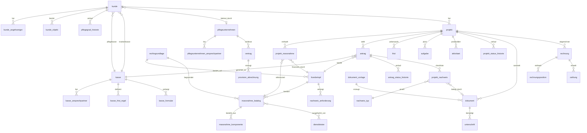

# CareCoach Pro — CRM- & Datenmodell (Entwurf v1)

> **Status:** Entwurf zur Abstimmung. **Keine Implementierung, kein Commit.**
> Ziel: lückenlose, rechtssichere, schnelle Antragsbearbeitung nach §40 SGB XI
> (und weiteren Fördertöpfen). Dieses Dokument definiert Entitäten, Beziehungen,
> Workflows, Pflichtfelder sowie die rechtliche Compliance-Schicht.

---

## 0. MVP-Scope (Version 1) — verbindlich

**Produktentscheidung:** Start als MVP mit **3–5 Pilotprojekten** und **standardisierten
§40-Maßnahmen**. Ziel ist nicht maximale Komplexität, sondern eine **möglichst hohe
Genehmigungsquote bei einfachen Standardmaßnahmen**.

**Prioritätenreihenfolge (steuert jede Designentscheidung):**
1. **Rechtssicherheit**
2. **Vollständige Unterlagen**
3. **Schnelle Bearbeitung durch die Pflegekasse**
4. **Standardisierte Prozesse**
5. **Skalierbarkeit**

### 0.1 In v1 vollständig modellierte Maßnahmen (Standardkatalog)

Nur die häufigsten, am einfachsten umsetzbaren Maßnahmen — jeweils mit fertiger BOM,
Standard-Begründung, Rechtsgrundlage und Nachweis-Profil:

| Code | Maßnahme | Kategorie | Förderfähig | Rechtsgrundlage |
|---|---|---|---|---|
| `STD-BAD` | Badumbau (bodengleiche Dusche) | bad | gesichert | §40 Abs.4 |
| `STD-HALTEGRIFF` | Haltegriffe (Bad/WC) | bad | gesichert | §40 Abs.4 |
| `STD-HANDLAUF` | Handläufe (Flur/Treppe) | treppen_lift | gesichert | §40 Abs.4 |
| `STD-RAMPE` | Rampe (modular, Hauseingang) | rampe | gesichert | §40 Abs.4 |
| `STD-SCHWELLE` | Schwellenabbau / -ausgleich | bodenbelag | gesichert | §40 Abs.4 |
| `STD-TUER` | Türverbreiterung | tueren | gesichert | §40 Abs.4 |

> Alle v1-Maßnahmen haben `foerderfaehig_status = gesichert` (kein Einzelfall-Risiko).
> AAL/Vayyar, Smart Locks etc. sind **bewusst nicht** im MVP-Katalog.

### 0.2 Herzstück v1: automatische Vollständigkeitsprüfung (§7.4)

Jeder Antrag wird **vor dem Einreichen automatisch** auf acht Prüfpunkte getestet; erst bei
„grün" ist der Übergang `antrag → pruefung` erlaubt:

1. **Pflichtunterlagen** vollständig (`projekt_nachweis` alle Pflicht = vorhanden)
2. **Fristen** gesetzt/eingehalten (Antrag vor Maßnahmenbeginn, Entscheidungsfrist berechnet)
3. **Gesetzesgrundlage** referenziert (`foerdertopf` + `rechtsgrundlage`)
4. **Begründung** vorhanden + enthält genau eines der drei §40-Kriterien
5. **Fotos** Ist-Zustand vorhanden
6. **Kostenvoranschlag** (detailliert, nicht pauschal) vorhanden
7. **Einwilligungen** (DSGVO) erteilt
8. **Abtretung** (§398 BGB) unterschrieben (für 0 €-Modell)

→ Detaillierte Regel-Engine in **§7.4**.

### 0.3 In v1 enthalten / verschoben

| In v1 enthalten | Auf Phase 2 verschoben |
|---|---|
| Kunden (A), Kassen (C) | Pflegeunternehmen-Verträge/Provision-Detail (B) |
| Standardkatalog + BOM (D, reduziert) | Voll-Abrechnung/Mahnwesen (G über Basis hinaus) |
| Pipeline + Antrag + Fristen (E) | §37 Abs.3-SaaS-Doku (J) |
| Dokumente + **Vollständigkeitsprüfung** (F) | DiPA (K) |
| 1 Standort „Berlin" (I, geseedet) | Mehr-Standort-Betrieb / regionale §45a-Logik |

---

## 1. Architekturprinzipien

1. **Relational (PostgreSQL)** als Quelle der Wahrheit; Redis nur Cache/Sessions (vgl. CLAUDE.md §3.1).
2. **Trennung Kunde ↔ Vorgang:** Ein Kunde kann über die Zeit **mehrere Projekte/Vorgänge** haben.
   Die CRM-Pipeline-Status hängen am `projekt`, nicht am `kunde`. Der Kunde trägt nur einen
   Lebenszyklus-Status (Lead/aktiv/inaktiv).
3. **Ein Vorgang → mehrere Anträge:** Ein Projekt kann parallele Anträge an verschiedene
   Fördertöpfe/Kassen enthalten (z. B. §40 Abs.4 + KfW 455-B mit **getrennten Rechnungen**).
4. **Compliance als Daten, nicht als Code:** Fristen, Pflicht-Nachweise, Förderhöhen,
   Gesetzesgrundlagen und Formularzuordnungen sind **konfigurierbare Stammdaten**
   (`foerdertopf`, `rechtsgrundlage`, `nachweis_anforderung`, `kasse_frist_regel`,
   `kasse_formular`). So bleiben Gesetzesänderungen pflegbar ohne Deploy.
5. **Nachvollziehbarkeit:** Status-Historien (`*_status_historie`), `audit_log`,
   Soft-Delete (`geloescht_am`) statt physischem Löschen bei rechtsrelevanten Entitäten.
6. **Geld immer dreigeteilt:** EK (netto), VK (brutto), Förderbetrag — Kundensicht
   (Eigenanteil) und interne Marge bleiben getrennt (vgl. CLAUDE.md §5.3).
7. **UUID-Primärschlüssel** überall; fachliche Nummern (`projektnummer`, `antragsnummer`)
   zusätzlich als sprechende, eindeutige Kennungen.
8. **Mandanten-/Standortfähigkeit von Beginn an:** eigene `standort`-Dimension (Berlin →
   München/Hamburg/Köln). Alle operativen Entitäten (`kunde`, `projekt`, `benutzer`,
   `pflegeunternehmen`) tragen `standort_id`. Regionale Regeln (z. B. §45a-Anerkennung je
   Bundesland, Leitkasse) hängen am Standort. Auswertungen und Berechtigungen filtern pro Standort.
9. **Hybrid-Persistenz (Umsetzungsstrategie):** Das Datenmodell wird zuerst vollständig als
   **TypeScript-Typen** abgebildet und über eine **austauschbare Service-Schicht** (`Repository`-
   Interface je Aggregat) angesprochen. Implementierung 1 = Mock/LocalStorage, Implementierung 2 =
   echtes FastAPI/PostgreSQL-Backend — **identische Signaturen**, sodass die UI entkoppelt bleibt
   und der Wechsel ohne UI-Änderung erfolgt.

**Legende Pflicht-Spalte:** `PK` Primärschlüssel · `FK` Fremdschlüssel · `✓` NOT NULL ·
`○` optional · `U` unique.

---

## 2. Modulübersicht

| # | Modul | Kern-Entitäten |
|---|---|---|
| A | **Kunden** | `kunde`, `kunde_angehoeriger`, `kunde_objekt`, `pflegegrad_historie` |
| B | **Pflegeunternehmen** | `pflegeunternehmen`, `pflegeunternehmen_ansprechpartner`, `vertrag`, `provision_abrechnung` |
| C | **Kassen** | `kasse`, `kasse_ansprechpartner`, `kasse_frist_regel`, `kasse_formular` |
| D | **Maßnahmenkatalog & Recht** | `foerdertopf`, `rechtsgrundlage`, `massnahme_katalog`, `massnahme_komponente`, `dienstleister`, `massnahme_dienstleister` |
| E | **CRM-Pipeline / Vorgang** | `projekt`, `projekt_massnahme`, `antrag`, `projekt_status_historie`, `antrag_status_historie`, `frist`, `aufgabe`, `aktivitaet` |
| F | **Dokumente & Nachweise** | `dokument_vorlage`, `dokument`, `unterschrift`, `nachweis_typ`, `nachweis_anforderung`, `projekt_nachweis` |
| G | **Abrechnung** | `rechnung`, `rechnungsposition`, `zahlung` |
| H | **Querschnitt** | `benutzer`, `audit_log` |
| I | **Standort/Mandant** | `standort` |
| J | **§37 Abs.3-Doku (SaaS)** *(Phase 2)* | `beratungseinsatz_37_3` |
| K | **DiPA** *(Phase 2)* | `dipa_katalog`, `dipa_nutzung` |

> **Scope-Markierung:** Module **A, C, D, E, F, I** + Basis von **H** bilden die **MVP-Version 1**
> (siehe §0). Module **B** (Verträge/Provision-Detail), **G** (Abrechnung über Basis hinaus),
> **J** und **K** sind **eingeplant, aber Phase 2** — Strukturen unten definiert, in v1 nicht aktiv.

### ER-Karte (vereinfacht)



---

## 3. Wertelisten (Enums)

| Enum | Werte |
|---|---|
| `pflegegrad` | 1, 2, 3, 4, 5 |
| `kunde_lebenszyklus` | `lead`, `interessent`, `aktiv`, `inaktiv`, `archiviert` |
| `projekt_status` (Pipeline) | `lead` → `beratung` → `antrag` → `pruefung` → `bewilligt` → `umsetzung` → `abgerechnet`; Sonderzustände: `abgelehnt`, `widerspruch`, `storniert` |
| `antrag_status` | `entwurf`, `eingereicht`, `in_pruefung`, `md_eingeschaltet`, `bewilligt`, `teilbewilligt`, `abgelehnt`, `genehmigungsfiktion`, `widerspruch` |
| `frist_typ` | `entscheidungsfrist`, `genehmigungsfiktion`, `widerspruchsfrist`, `nachweis_nachreichung`, `umsetzung`, `nachweis_37_3` |
| `foerdertopf.betrag_einheit` | `je_massnahme`, `einmalig`, `monatlich`, `jaehrlich` |
| `foerdertopf.art` | `zuschuss`, `kostenerstattung`, `sachleistung`, `kredit`, `steuervorteil` |
| `foerderfaehig_status` | `gesichert`, `einzelfall`, `nicht_foerderfaehig` |
| `massnahme_kategorie` | `bad`, `tueren`, `treppen_lift`, `bodenbelag`, `beleuchtung`, `rampe`, `aal_technik`, `sonstige` |
| `beziehung` (Angehörige) | `ehepartner`, `kind`, `elternteil`, `geschwister`, `betreuer`, `sonstige` |
| `kassenart` | `krankenkasse`, `pflegekasse`, `beides` |
| `traegergruppe` | `aok`, `ersatzkasse`, `bkk`, `ikk`, `knappschaft`, `landwirtschaftlich`, `privat` |
| `rechtsform` | `gmbh`, `ug`, `ev`, `gbr`, `einzelunternehmen`, `sonstige` |
| `vertragstyp` | `kooperation`, `saas`, `provision` |
| `gewerk` (Dienstleister) | `sanitaer`, `elektro`, `trockenbau`, `fliesen`, `schreiner`, `aal`, `grosshandel`, `sonstige` |
| `dokument_kategorie` | `anschreiben`, `antrag`, `vollmacht`, `einwilligung`, `abtretungserklaerung`, `kostenvoranschlag`, `attest_anforderung`, `bescheid`, `widerspruch`, `rechnung`, `foto`, `scan` |
| `dokument_status` | `entwurf`, `generiert`, `versendet`, `unterschrieben`, `eingereicht`, `bewilligt`, `abgelehnt` |
| `unterschrift_status` | `angefordert`, `unterschrieben`, `abgelehnt` |
| `nachweis_status` | `offen`, `vorhanden`, `geprueft`, `fehlt` |
| `benutzer_rolle` | `admin`, `berater`, `backoffice`, `readonly` |
| `pruef_status` (Vollständigkeitsprüfung) | `ok`, `warnung`, `fehler` |
| `beratungseinsatz_status` *(Phase 2)* | `offen`, `durchgefuehrt`, `ueberfaellig` |
| `beratungseinsatz_rhythmus` *(Phase 2)* | `halbjaehrlich` (PG 2–3), `vierteljaehrlich` (PG 4–5) |
| `dipa_status` *(Phase 2)* | `beantragt`, `aktiv`, `beendet` |

---

## 4. Entitäten (Tabellen)

### A — Kunden

#### `kunde`
| Feld | Typ | Pflicht | Hinweis |
|---|---|---|---|
| id | UUID | PK | |
| kundennummer | TEXT | U ✓ | generiert, sprechend |
| anrede | enum | ○ | herr/frau/divers |
| vorname | TEXT | ✓ | |
| nachname | TEXT | ✓ | |
| geburtsdatum | DATE | ○ | für Attest/Antrag relevant |
| strasse | TEXT | ✓ | |
| plz | TEXT | ✓ | |
| ort | TEXT | ✓ | |
| bundesland | enum | ○ | Förder-/§45a-Regeln je Land |
| telefon | TEXT | ○ | |
| mobil | TEXT | ○ | |
| email | TEXT | ○ | Format-validiert |
| pflegegrad | pflegegrad | ✓ | 1–5 |
| pflegegrad_seit | DATE | ○ | |
| hauptdiagnose | TEXT | ○ | Klartext |
| icd10_codes | TEXT[] | ○ | z. B. `{M17.1}` — Pflicht für §40-Begründung |
| pflegekasse_id | UUID | FK ✓ | → `kasse` (Rolle Pflegekasse) |
| krankenkasse_id | UUID | FK ○ | → `kasse` (Rolle Krankenkasse) |
| versichertennummer | TEXT | ✓ | |
| betreuender_pflegedienst_id | UUID | FK ○ | → `pflegeunternehmen` |
| werber_pflegedienst_id | UUID | FK ○ | Lead-Quelle (Provision) |
| haushalt_personen | INT | ○ | |
| personen_mit_pflegegrad | INT | ✓ | 1–4, Förder-Multiplikator |
| wohnform | enum | ○ | miete/eigentum/wg/heim |
| etage | INT | ○ | |
| aufzug_vorhanden | BOOL | ○ | |
| einwilligung_dsgvo | BOOL | ✓ | + `einwilligung_datum` |
| einwilligung_datum | DATE | ○ | |
| lebenszyklus | enum | ✓ | Default `lead` |
| notiz | TEXT | ○ | |
| erstellt_am / geaendert_am | TIMESTAMPTZ | ✓ | |
| erstellt_von | UUID | FK ✓ | → `benutzer` |
| geloescht_am | TIMESTAMPTZ | ○ | Soft-Delete |

#### `kunde_angehoeriger` (1:n)
| Feld | Typ | Pflicht | Hinweis |
|---|---|---|---|
| id | UUID | PK | |
| kunde_id | UUID | FK ✓ | |
| name | TEXT | ✓ | |
| beziehung | enum | ✓ | |
| telefon / mobil / email | TEXT | ○ | |
| ist_hauptkontakt | BOOL | ✓ | genau einer pro Kunde empfohlen |
| ist_bevollmaechtigter | BOOL | ✓ | unterschreibt Abtretung/Vollmacht |
| vollmacht_dokument_id | UUID | FK ○ | → `dokument` |

#### `kunde_objekt` (Wohnobjekt für Umbau, 0:n)
| Feld | Typ | Pflicht | Hinweis |
|---|---|---|---|
| id | UUID | PK | |
| kunde_id | UUID | FK ✓ | |
| strasse/plz/ort | TEXT | ✓ | abweichend von Meldeadresse möglich |
| eigentumsverhaeltnis | enum | ○ | eigentum/miete (Vermieterzustimmung!) |
| vermieter_zustimmung | BOOL | ○ | Pflicht bei Miete für bauliche Maßnahmen |
| scan_id | UUID | ○ | Verknüpfung Raumscan (App) |

#### `pflegegrad_historie` (0:n) — Audit der PG-Änderungen
`id PK`, `kunde_id FK ✓`, `pflegegrad ✓`, `gueltig_ab ✓`, `bescheid_dokument_id FK ○`.

---

### B — Pflegeunternehmen (ambulante Dienste / Partner)

#### `pflegeunternehmen`
| Feld | Typ | Pflicht | Hinweis |
|---|---|---|---|
| id | UUID | PK | |
| firmenname | TEXT | ✓ | |
| rechtsform | enum | ○ | |
| ik_nummer | TEXT | ○ | Institutionskennzeichen |
| zulassung_72_sgb_xi | BOOL | ✓ | Versorgungsvertrag vorhanden? |
| strasse/plz/ort/bundesland | TEXT | ○ | |
| telefon/email/website | TEXT | ○ | |
| ust_id | TEXT | ○ | |
| iban | TEXT | ○ | für Provisionsauszahlung |
| status | enum | ✓ | interessent/partner/inaktiv |
| erstellt_am … | TIMESTAMPTZ | ✓ | |

#### `pflegeunternehmen_ansprechpartner` (1:n)
`id PK`, `pflegeunternehmen_id FK ✓`, `name ✓`, `funktion ○`, `telefon/email ○`, `ist_hauptkontakt ✓`.

#### `vertrag`
| Feld | Typ | Pflicht | Hinweis |
|---|---|---|---|
| id | UUID | PK | |
| pflegeunternehmen_id | UUID | FK ✓ | |
| vertragstyp | enum | ✓ | kooperation/saas/provision |
| vertragsnummer | TEXT | U ✓ | |
| beginn | DATE | ✓ | |
| ende | DATE | ○ | |
| status | enum | ✓ | entwurf/aktiv/gekuendigt/abgelaufen |
| saas_preis_monat | NUMERIC | ○ | 79–199 € |
| provision_prozent | NUMERIC | ○ | Default-Satz (8–15 %) |
| kuendigungsfrist_tage | INT | ○ | |
| vertrag_dokument_id | UUID | FK ○ | unterschriebener Vertrag |

#### `provision_abrechnung`
`id PK`, `vertrag_id FK ✓`, `projekt_id FK ✓`, `basisbetrag ✓`, `prozent ✓`, `betrag ✓`,
`status enum ✓` (offen/abgerechnet/ausgezahlt), `faellig_am ○`, `ausgezahlt_am ○`.

---

### C — Kranken-/Pflegekassen

#### `kasse`
| Feld | Typ | Pflicht | Hinweis |
|---|---|---|---|
| id | UUID | PK | |
| name | TEXT | ✓ | z. B. „AOK Nordost" |
| kassenart | enum | ✓ | krankenkasse/pflegekasse/beides |
| traegergruppe | enum | ○ | |
| ik_nummer | TEXT | ○ | |
| strasse/plz/ort/bundesland | TEXT | ○ | |
| telefon/fax/email/website | TEXT | ○ | |
| postanschrift_antraege | TEXT | ○ | abweichende Antragsadresse |
| elektronischer_eingang | TEXT | ○ | Portal/Mail für digitale Einreichung |
| akzeptiert_abtretung | BOOL | ✓ | §398-Modell möglich? |
| standard_frist_tage | INT | ✓ | Default 21 (§40 Abs.7) |
| frist_mit_md_tage | INT | ✓ | Default 35 (5 Wochen) |
| notiz | TEXT | ○ | Eigenheiten der Kasse |

#### `kasse_ansprechpartner` (1:n)
`id PK`, `kasse_id FK ✓`, `name ✓`, `abteilung ○`, `telefon/email ○`, `zustaendig_fuer ○`
(z. B. „§40 Wohnumfeld").

#### `kasse_frist_regel` (Frist je Fördertopf/Kasse)
`id PK`, `kasse_id FK ✓`, `foerdertopf_id FK ✓`, `frist_tage ✓`, `frist_mit_md_tage ○`,
`genehmigungsfiktion BOOL ✓`, `rechtsgrundlage_id FK ○`.

#### `kasse_formular` (welches Formular die Kasse verlangt)
`id PK`, `kasse_id FK ✓`, `foerdertopf_id FK ✓`, `dokument_vorlage_id FK ✓`,
`pflicht BOOL ✓`, `hinweis ○`.

---

### D — Maßnahmenkatalog & Recht

#### `foerdertopf` (Förderprogramm)
| Feld | Typ | Pflicht | Hinweis |
|---|---|---|---|
| id | UUID | PK | |
| code | TEXT | U ✓ | `40.4`, `40.2`, `45b`, `45f`, `45g`, `kfw455b`, `42a`, `35a_estg`, `33b_estg` |
| bezeichnung | TEXT | ✓ | |
| rechtsgrundlage_id | UUID | FK ✓ | |
| max_betrag | NUMERIC | ✓ | z. B. 4180.00 |
| betrag_einheit | enum | ✓ | je_massnahme/monatlich/… |
| multiplikator_moeglich | BOOL | ✓ | |
| max_multiplikator | INT | ○ | 4 (Haushalt) |
| ab_pflegegrad | pflegegrad | ○ | 1 |
| pflegegrad_erforderlich | BOOL | ✓ | KfW: false |
| art | enum | ✓ | zuschuss/kostenerstattung/… |
| kombinierbar_mit | TEXT[] | ○ | Codes |
| gueltig_ab / gueltig_bis | DATE | ✓/○ | Indexierung dokumentierbar |
| hinweis | TEXT | ○ | |

**Seed-Werte (Stand 2025/2026, vgl. CLAUDE.md Anhang):**

| code | Betrag | Einheit | ab PG | Art | Besonderheit |
|---|---|---|---|---|---|
| `40.4` | 4.180 € | je_massnahme | 1 | kostenerstattung | ×4 Haushalt = 16.720 € |
| `40.2` | 42 € | monatlich | 1 | sachleistung | Verbrauchshilfsmittel |
| `45b` | 131 € | monatlich | 1 | kostenerstattung | übertragbar bis 30.06. Folgejahr |
| `45f` | 214 € | monatlich | 1 | zuschuss | Wohngruppe |
| `45g` | 10.452 € | einmalig | 1 | zuschuss | WG-Anschub |
| `kfw455b` | 6.250 € | einmalig | – | zuschuss | kein PG nötig, getrennte Rechnung |
| `42a` | 3.539 € | jaehrlich | 2 | sachleistung | KZP+VP |
| `35a_estg` | 5.200 € | jaehrlich | – | steuervorteil | Handwerker/haushaltsnah |
| `33b_estg` | 600–1.800 € | jaehrlich | 2 | steuervorteil | Pflegepauschbetrag |

#### `rechtsgrundlage` (Gesetze, Urteile, Richtlinien)
| Feld | Typ | Pflicht | Hinweis |
|---|---|---|---|
| id | UUID | PK | |
| typ | enum | ✓ | gesetz/urteil/richtlinie/rundschreiben |
| kuerzel | TEXT | ✓ | `§40 Abs.4 SGB XI`, `BSG B 3 P 4/16 R` |
| titel | TEXT | ○ | |
| datum | DATE | ○ | |
| kerninhalt | TEXT | ✓ | für Begründungsbausteine |
| relevanz | enum | ○ | foerderfaehig / nicht_foerderfaehig (Rspr.) |
| fundstelle / url | TEXT | ○ | |

**Seed (Rechtsprechung Türzugang, vgl. CLAUDE.md §2.2):**
- `BSG B 3 P 4/16 R` (25.01.2017) — el. Türantriebe = §40-förderfähig → `foerderfaehig`
- `BSG B 3 P 5/22 R` (30.11.2023) — kabellose Video-Gegensprechanlage NICHT §40 → `nicht_foerderfaehig`

#### `massnahme_katalog`
| Feld | Typ | Pflicht | Hinweis |
|---|---|---|---|
| id | UUID | PK | |
| code | TEXT | U ✓ | |
| bezeichnung | TEXT | ✓ | |
| kategorie | enum | ✓ | |
| beschreibung | TEXT | ○ | |
| foerdertopf_id | UUID | FK ✓ | Standard-Quelle |
| rechtsgrundlage_id | UUID | FK ○ | z. B. BSG-Urteil bei Türantrieb |
| standard_vk_brutto | NUMERIC | ✓ | |
| standard_ek_netto | NUMERIC | ✓ | |
| din18040_ref | TEXT | ○ | |
| foerderfaehig_status | enum | ✓ | gesichert/einzelfall/nicht_foerderfaehig |
| standard_begruendung | TEXT | ○ | Textbaustein für Antrag |
| pflicht_nachweis_zusatz | TEXT[] | ○ | maßnahmenspezifische Extra-Nachweise |
| aktiv | BOOL | ✓ | |

> **Compliance-Hinweis Vayyar:** `foerderfaehig_status = einzelfall`,
> `standard_begruendung` mit Wortlaut „bezuschussungsfähig als wohnumfeldverbessernde
> Maßnahme nach §40 Abs.4 SGB XI — Einzelfallentscheidung". Verbotene Formulierungen
> („garantierte Kostenübernahme", „im Hilfsmittelverzeichnis gelistet") werden auf
> Vorlagen-Ebene validiert (siehe §8).

#### `massnahme_komponente` (BOM / Materialliste, 1:n)
`id PK`, `massnahme_id FK ✓`, `position ✓`, `menge ○`, `einheit ○`, `ek_netto ✓`,
`vk_brutto ✓`, `ist_montage BOOL ✓`, `dienstleister_id FK ○`.

#### `dienstleister` (Handwerker/Lieferanten)
`id PK`, `name ✓`, `gewerk enum ✓`, `ansprechpartner ○`, `telefon/email ○`,
`strasse/plz/ort ○`, `provision_prozent NUMERIC ○` (8–15 %), `bewertung ○`, `aktiv BOOL ✓`.

#### `massnahme_dienstleister` (m:n bevorzugte Anbieter je Maßnahme)
`massnahme_id FK ✓`, `dienstleister_id FK ✓`, `prioritaet ○` — zusammengesetzter PK.

---

### E — CRM-Pipeline / Vorgang

#### `projekt` (zentraler Vorgang/Fall)
| Feld | Typ | Pflicht | Hinweis |
|---|---|---|---|
| id | UUID | PK | |
| projektnummer | TEXT | U ✓ | |
| kunde_id | UUID | FK ✓ | |
| titel | TEXT | ○ | z. B. „Badumbau + Sturzsensor" |
| pipeline_status | enum | ✓ | siehe §6.1 |
| prioritaet | enum | ○ | niedrig/mittel/hoch |
| zustaendiger_benutzer_id | UUID | FK ○ | |
| werber_pflegedienst_id | UUID | FK ○ | Provision |
| ausfuehrender_dienstleister_id | UUID | FK ○ | |
| summe_vk_brutto | NUMERIC | ○ | aggregiert |
| summe_ek_netto | NUMERIC | ○ | aggregiert |
| summe_foerderung | NUMERIC | ○ | aggregiert |
| eigenanteil | NUMERIC | ○ | 0 € bei Abtretung |
| abtretung_aktiv | BOOL | ✓ | §398 BGB |
| erstellt_am / geaendert_am / abgeschlossen_am | TIMESTAMPTZ | ✓/✓/○ | |

#### `projekt_massnahme` (gewählte Maßnahmen, n:m mit konkreten Werten)
| Feld | Typ | Pflicht | Hinweis |
|---|---|---|---|
| id | UUID | PK | |
| projekt_id | UUID | FK ✓ | |
| massnahme_id | UUID | FK ✓ | → Katalog |
| foerdertopf_id | UUID | FK ✓ | konkrete Förderquelle |
| vk_brutto | NUMERIC | ✓ | überschreibbar ggü. Standard |
| ek_netto | NUMERIC | ✓ | |
| foerderbetrag_beantragt | NUMERIC | ✓ | |
| raum | TEXT | ○ | |
| prioritaet | enum | ○ | |
| begruendung | TEXT | ○ | KI-generiert, editierbar |

#### `antrag`
| Feld | Typ | Pflicht | Hinweis |
|---|---|---|---|
| id | UUID | PK | |
| antragsnummer | TEXT | U ✓ | |
| projekt_id | UUID | FK ✓ | |
| foerdertopf_id | UUID | FK ✓ | |
| kasse_id | UUID | FK ✓ | |
| status | enum | ✓ | siehe §6.2 |
| gestellt_am | DATE | ○ | **muss vor Maßnahmenbeginn** |
| eingangsbestaetigung_am | DATE | ○ | startet Frist |
| entscheidungsfrist | DATE | ○ | berechnet |
| genehmigungsfiktion_ab | DATE | ○ | berechnet |
| md_eingeschaltet_am | DATE | ○ | verlängert Frist auf 5 Wochen |
| beantragter_betrag | NUMERIC | ✓ | |
| bewilligter_betrag | NUMERIC | ○ | |
| bescheid_datum | DATE | ○ | |
| bescheid_dokument_id | UUID | FK ○ | |
| ablehnungsgrund | TEXT | ○ | |
| widerspruch_frist | DATE | ○ | Bescheid + 1 Monat |
| abtretung_dokument_id | UUID | FK ○ | §398-Erklärung |

#### `projekt_status_historie` / `antrag_status_historie`
`id PK`, `projekt_id`/`antrag_id FK ✓`, `von_status ○`, `nach_status ✓`,
`geaendert_am ✓`, `geaendert_von FK ✓`, `kommentar ○`.

#### `frist` (zentrale Fristenüberwachung)
| Feld | Typ | Pflicht | Hinweis |
|---|---|---|---|
| id | UUID | PK | |
| projekt_id | UUID | FK ○ | |
| antrag_id | UUID | FK ○ | (genau eines von beiden gesetzt) |
| typ | frist_typ | ✓ | |
| faellig_am | DATE | ✓ | |
| erinnerung_am | DATE | ○ | z. B. −3 Tage |
| erledigt | BOOL | ✓ | |
| erledigt_am | DATE | ○ | |
| rechtsgrundlage_id | UUID | FK ○ | |

#### `aufgabe`
`id PK`, `projekt_id FK ✓`, `titel ✓`, `beschreibung ○`, `faellig_am ○`,
`status enum ✓` (offen/erledigt), `zugewiesen_an FK ○`.

#### `aktivitaet` (CRM-Protokoll)
`id PK`, `projekt_id FK ○`, `kunde_id FK ○`, `typ enum ✓`
(notiz/anruf/email/termin/statuswechsel), `inhalt ✓`, `erstellt_am ✓`, `erstellt_von FK ✓`.

---

### F — Dokumente & Nachweise

#### `dokument_vorlage` (Templates)
| Feld | Typ | Pflicht | Hinweis |
|---|---|---|---|
| id | UUID | PK | |
| code | TEXT | U ✓ | |
| bezeichnung | TEXT | ✓ | |
| kategorie | enum | ✓ | anschreiben/antrag/vollmacht/… |
| foerdertopf_id | UUID | FK ○ | topfspezifisch |
| kasse_id | UUID | FK ○ | kassenspezifisch |
| format | enum | ✓ | pdf/docx/html |
| inhalt | TEXT | ✓ | Vorlagentext mit Platzhaltern |
| platzhalter | TEXT[] | ○ | `{{kunde.nachname}}` … |
| rechtsgrundlage_id | UUID | FK ○ | |
| version | INT | ✓ | |
| aktiv | BOOL | ✓ | |

**Pflicht-Vorlagensatz (Dokumentengenerator):**
Anschreiben Kasse · §40-Antrag · §45b-Antrag · KfW-455-B-Antrag · Vollmacht ·
Einwilligung (DSGVO) · **Abtretungserklärung §398 BGB** · Kostenvoranschlag ·
Attest-Anforderung (an Arzt) · Widerspruch · Rechnung.

#### `dokument` (Instanzen — generiert oder hochgeladen)
| Feld | Typ | Pflicht | Hinweis |
|---|---|---|---|
| id | UUID | PK | |
| projekt_id | UUID | FK ○ | |
| kunde_id | UUID | FK ○ | |
| antrag_id | UUID | FK ○ | |
| vorlage_id | UUID | FK ○ | falls generiert |
| kategorie | enum | ✓ | inkl. foto/scan |
| titel | TEXT | ✓ | |
| storage_key | TEXT | ✓ | Objektspeicher-Pfad |
| mime_type | TEXT | ○ | |
| groesse_bytes | BIGINT | ○ | |
| status | dokument_status | ✓ | |
| unterschrift_erforderlich | BOOL | ✓ | |
| erstellt_am | TIMESTAMPTZ | ✓ | |
| erstellt_von | UUID | FK ✓ | |

#### `unterschrift`
`id PK`, `dokument_id FK ✓`, `unterzeichner_typ enum ✓` (kunde/angehoeriger/carecoach),
`unterzeichner_name ✓`, `anbieter enum ✓` (docusign/manuell),
`status enum ✓`, `angefordert_am ○`, `unterschrieben_am ○`, `rechtsgrundlage_id FK ○`.

#### `nachweis_typ` (Katalog der Nachweisarten)
`id PK`, `code U ✓`, `bezeichnung ✓`, `beschreibung ○`, `rechtsgrundlage_id FK ○`.
Beispiele: `aerztliches_attest`, `kostenvoranschlag`, `foto_ist_zustand`,
`abtretungserklaerung`, `einwilligung_dsgvo`, `vollmacht`, `pflegegrad_bescheid`,
`vermieter_zustimmung`.

#### `nachweis_anforderung` (Soll-Checkliste je Fördertopf)
`id PK`, `foerdertopf_id FK ✓`, `nachweis_typ_id FK ✓`, `pflicht BOOL ✓`,
`massnahme_kategorie enum ○` (nur bei bestimmten Maßnahmen), `hinweis ○`.

#### `projekt_nachweis` (Ist-Zustand je Antrag)
`id PK`, `antrag_id FK ✓`, `nachweis_typ_id FK ✓`, `dokument_id FK ○`,
`status nachweis_status ✓`, `geprueft_von FK ○`, `geprueft_am ○`.

---

### G — Abrechnung

#### `rechnung`
`id PK`, `projekt_id FK ✓`, `empfaenger_typ enum ✓` (kasse/kunde/pflegeunternehmen),
`kasse_id FK ○`, `kunde_id FK ○`, `rechnungsnummer U ✓`, `datum ✓`,
`betrag_netto ✓`, `mwst ✓`, `betrag_brutto ✓`,
`status enum ✓` (entwurf/gestellt/bezahlt/storniert), `abtretung BOOL ✓`,
`faellig_am ○`, `bezahlt_am ○`.

#### `rechnungsposition`
`id PK`, `rechnung_id FK ✓`, `bezeichnung ✓`, `menge ✓`, `einzelpreis ✓`,
`mwst_satz ✓`, `betrag ✓`, `projekt_massnahme_id FK ○`.

#### `zahlung`
`id PK`, `rechnung_id FK ✓`, `betrag ✓`, `eingegangen_am ✓`, `zahlungsart enum ○`.

---

### H — Querschnitt

#### `benutzer`
`id PK`, `name ✓`, `email U ✓`, `rolle enum ✓`, `aktiv BOOL ✓`, `passwort_hash ✓`.

#### `audit_log`
`id PK`, `entitaet ✓`, `entitaet_id ✓`, `aktion enum ✓` (create/update/delete),
`benutzer_id FK ✓`, `zeitpunkt ✓`, `aenderungen JSONB ○`.

---

### I — Standort / Mandant

#### `standort`
| Feld | Typ | Pflicht | Hinweis |
|---|---|---|---|
| id | UUID | PK | |
| name | TEXT | ✓ | z. B. „Berlin" |
| bundesland | enum | ✓ | steuert regionale Regeln (§45a) |
| leitkasse_id | UUID | FK ○ | → `kasse` (z. B. AOK Nordost) |
| adresse | TEXT | ○ | |
| aktiv | BOOL | ✓ | |

> `standort_id` (FK ✓) wird ergänzt an: `kunde`, `projekt`, `benutzer`, `pflegeunternehmen`.
> **v1:** genau ein geseedeter Standort „Berlin"; Mehr-Standort-Betrieb erst Phase 2.

---

### J — §37 Abs.3-Doku (B2B-SaaS) — *Phase 2*

#### `beratungseinsatz_37_3`
Pflicht-Beratungsbesuch für Pflegegeldbezieher (halbjährlich PG 2–3, vierteljährlich PG 4–5;
fehlender Nachweis → Pflegegeldkürzung).

| Feld | Typ | Pflicht | Hinweis |
|---|---|---|---|
| id | UUID | PK | |
| kunde_id | UUID | FK ✓ | |
| pflegeunternehmen_id | UUID | FK ✓ | durchführender Dienst |
| faellig_am | DATE | ✓ | abgeleitet aus PG-Rhythmus |
| durchgefuehrt_am | DATE | ○ | |
| status | enum | ✓ | offen/durchgefuehrt/ueberfaellig |
| nachweis_dokument_id | UUID | FK ○ | |
| rhythmus | enum | ✓ | halbjaehrlich/vierteljaehrlich |

---

### K — DiPA (§40a/b SGB XI) — *Phase 2*

#### `dipa_katalog`
`id PK`, `name ✓`, `hersteller ○`, `zugelassen BOOL ✓` (aktuell: keine App zugelassen),
`betrag_monat NUMERIC ○` (bis 40 € + 30 €), `rechtsgrundlage_id FK ○`.

#### `dipa_nutzung`
`id PK`, `kunde_id FK ✓`, `dipa_id FK ✓`, `beginn DATE ✓`, `ende DATE ○`,
`status enum ✓` (beantragt/aktiv/beendet).

---

## 5. Beziehungen (Kardinalitäten)

| Von | Beziehung | Nach | Kardinalität |
|---|---|---|---|
| kunde | hat | kunde_angehoeriger | 1 : n |
| kunde | hat | projekt | 1 : n |
| kunde | Pflege-/Krankenkasse | kasse | n : 1 (×2 Rollen) |
| kunde | betreut/geworben | pflegeunternehmen | n : 1 (×2 Rollen) |
| pflegeunternehmen | hat | vertrag | 1 : n |
| vertrag | erzeugt | provision_abrechnung | 1 : n |
| kasse | definiert | kasse_frist_regel | 1 : n |
| kasse | verlangt | kasse_formular | 1 : n |
| foerdertopf | fördert | massnahme_katalog | 1 : n |
| foerdertopf | verlangt | nachweis_anforderung | 1 : n |
| massnahme_katalog | besteht aus | massnahme_komponente | 1 : n |
| massnahme_katalog | bevorzugt | dienstleister | m : n |
| projekt | enthält | projekt_massnahme | 1 : n |
| projekt | stellt | antrag | 1 : n |
| projekt | überwacht | frist | 1 : n |
| antrag | hat Checkliste | projekt_nachweis | 1 : n |
| projekt_nachweis | belegt durch | dokument | n : 1 |
| dokument_vorlage | erzeugt | dokument | 1 : n |
| dokument | benötigt | unterschrift | 1 : n |
| projekt | abgerechnet als | rechnung | 1 : n |

---

## 6. Workflows / State Machines

### 6.1 CRM-Pipeline (`projekt.pipeline_status`)

```
lead → beratung → antrag → pruefung → bewilligt → umsetzung → abgerechnet
                              │
                              ├─→ abgelehnt → widerspruch → (bewilligt | abgelehnt[endgültig])
                              │
   (jeder Status) ───────────┴─→ storniert
```

| Übergang | Bedingung / Trigger | Pflicht-Vorbedingung |
|---|---|---|
| lead → beratung | Erstkontakt erfasst, Termin | Einwilligung DSGVO |
| beratung → antrag | Raumscan + Maßnahmen gewählt | ≥1 `projekt_massnahme` |
| antrag → pruefung | Antrag eingereicht | **alle Pflicht-`projekt_nachweis` = vorhanden** (§7.1) |
| pruefung → bewilligt | Bescheid positiv **oder** Genehmigungsfiktion | `antrag.status ∈ {bewilligt, genehmigungsfiktion}` |
| pruefung → abgelehnt | Bescheid negativ | Ablehnungsgrund erfasst |
| abgelehnt → widerspruch | innerhalb `widerspruch_frist` | neues/besseres Attest |
| bewilligt → umsetzung | Auftrag an Dienstleister | bewilligter Betrag bekannt |
| umsetzung → abgerechnet | Rechnung gestellt (ggf. Abtretung) | Abnahme/Fotos Soll-Zustand |

### 6.2 Antrags-Lebenszyklus & Fristen (`antrag.status`)

```
entwurf → eingereicht → in_pruefung ──→ bewilligt
                            │   │           
                            │   └→ md_eingeschaltet → bewilligt | teilbewilligt | abgelehnt
                            │
                            ├→ genehmigungsfiktion   (Frist überschritten ohne Bescheid)
                            └→ abgelehnt → widerspruch
```

**Fristberechnung (automatisch erzeugte `frist`-Datensätze):**
- `entscheidungsfrist = eingangsbestaetigung_am + kasse.standard_frist_tage` (Default **21 Tage**)
- Bei MD-Einschaltung: `+ kasse.frist_mit_md_tage` (Default **35 Tage**)
- `genehmigungsfiktion_ab = entscheidungsfrist` → wird Frist ohne Bescheid überschritten,
  gilt der Antrag als **genehmigt** (§40 Abs.7 SGB XI). System setzt automatisch
  `status = genehmigungsfiktion` und legt Beleg-Aktivität an.
- `widerspruch_frist = bescheid_datum + 1 Monat` (bei Ablehnung).
- Erinnerungen (`frist.erinnerung_am`) z. B. 3 Tage vor Ablauf an `zustaendiger_benutzer`.

### 6.3 Dokumenten-/Unterschriftsfluss

```
Vorlage wählen → Platzhalter aus DB füllen → dokument(entwurf)
   → generiert → (Unterschrift erforderlich? → unterschrift.angefordert → unterschrieben)
   → versendet (an Kasse) → eingereicht → bewilligt/abgelehnt
```

---

## 7. Förderprozess §40 SGB XI — Compliance-Engine

### 7.1 Pflicht-Nachweise je Antragstyp (`nachweis_anforderung`)

| Nachweis | §40 Abs.4 | §45b | KfW 455-B | Rechtsbezug |
|---|---|---|---|---|
| Antrag **vor** Maßnahmenbeginn | **Pflicht** | Pflicht | **Pflicht** | §40 Abs.4 |
| Begründung mit 1 der 3 Gesetzeskriterien | **Pflicht** | – | – | §40 Abs.4 |
| Ärztliches Attest (ICD-10 + Funktionseinschränkung) | **Pflicht** | optional | optional | Bewilligungspraxis |
| Detaillierter Kostenvoranschlag (nicht pauschal) | **Pflicht** | – | **Pflicht** | – |
| Fotos Ist-Zustand | **Pflicht** | – | empfohlen | – |
| Abtretungserklärung §398 BGB | Pflicht* | Pflicht* | Pflicht* | §398 BGB |
| Einwilligung DSGVO | **Pflicht** | **Pflicht** | **Pflicht** | DSGVO |
| Vollmacht (falls Angehöriger handelt) | bedingt | bedingt | bedingt | – |
| Pflegegrad-Bescheid | empfohlen | **Pflicht** | – | – |
| Vermieterzustimmung (bei Miete) | bedingt | – | bedingt | baurechtlich |

\* nur für das **0 €-Eigenanteil-Modell** (Direktabrechnung mit der Kasse).

> **Gate-Regel:** Übergang `antrag → pruefung` ist **gesperrt**, solange ein Pflicht-Nachweis
> den Status `offen`/`fehlt` hat. Das System zeigt eine Vollständigkeitscheckliste pro Antrag.

### 7.2 Begründungsbausteine (genau **eines** der drei Kriterien, §40 Abs.4)

1. „…ermöglicht die häusliche Pflege"
2. „…erleichtert die häusliche Pflege erheblich"
3. „…stellt die selbstständige Lebensführung wieder her"

Gespeichert in `rechtsgrundlage.kerninhalt` / `massnahme_katalog.standard_begruendung`;
der KI-Antragsgenerator (CLAUDE.md §3.5) füllt diese in den Antragstext.

### 7.3 Rechtsgrundlagen-Register (Auszug, `rechtsgrundlage`)

| Kürzel | Inhalt | Flag |
|---|---|---|
| §40 Abs.4 SGB XI | Wohnumfeldverbesserung bis 4.180 € | – |
| §40 Abs.7 SGB XI | Genehmigungsfiktion bei Fristüberschreitung | – |
| §398 BGB | Abtretung (Direktabrechnung) | – |
| BSG B 3 P 4/16 R | el. Türantriebe förderfähig | foerderfaehig |
| BSG B 3 P 5/22 R | kabellose Video-Gegensprechanlage nicht §40 | nicht_foerderfaehig |

---

### 7.4 Vollständigkeitsprüfung (Regel-Engine, MVP-Herzstück)

Funktion `pruefe_antrag(antrag) → Pruefergebnis`. Liefert je Prüfpunkt
`{ status: ok|warnung|fehler, meldung }`. **Gate:** `antrag → pruefung` nur, wenn **kein
`fehler`** vorliegt. Reihenfolge entspricht der Produktpriorität (Recht → Unterlagen → Frist).

| # | Prüfpunkt | Bedingung (ok) | Schwere bei Verstoß |
|---|---|---|---|
| 1 | **Gesetzesgrundlage** | `antrag.foerdertopf_id` gesetzt **und** `foerdertopf.rechtsgrundlage_id` vorhanden | fehler |
| 2 | **Antrag vor Beginn** | `gestellt_am` < frühestes Umsetzungsdatum/Auftrag | fehler |
| 3 | **Begründung** | `projekt_massnahme.begruendung` nicht leer **und** enthält genau eines der 3 §40-Kriterien | fehler |
| 4 | **Pflichtunterlagen** | alle `nachweis_anforderung(pflicht=true)` → `projekt_nachweis.status = vorhanden\|geprueft` | fehler |
| 5 | **Fotos Ist-Zustand** | ≥1 `dokument(kategorie=foto)` am Projekt | fehler |
| 6 | **Kostenvoranschlag** | `dokument(kategorie=kostenvoranschlag)` vorhanden, Positionen detailliert (nicht pauschal) | fehler |
| 7 | **Einwilligung DSGVO** | `kunde.einwilligung_dsgvo = true` + Datum | fehler |
| 8 | **Abtretung §398** | wenn `projekt.abtretung_aktiv`: unterschriebene Abtretung vorhanden | fehler (sonst Eigenanteil-Warnung) |
| 9 | **Förder-Deckel** | `Σ foerderbetrag` ≤ `min(personen_mit_pflegegrad,4) × 4.180 €` | warnung |
| 10 | **Wording-Compliance** | keine verbotenen Phrasen in Begründung/Vorlage (§8.4) | fehler |
| 11 | **Frist-Status** | offene `frist`-Datensätze nicht überfällig; Erinnerungen gesetzt | warnung |

**Ampel-Ausgabe** je Antrag: Anzahl `ok`/`warnung`/`fehler` + Liste der offenen Punkte
(als To-do für den Berater). Ziel: lückenloser Antrag → hohe Genehmigungsquote.

---

## 8. Geschäftsregeln & Validierungen (Auszug)

1. **Förder-Deckel:** `Σ foerderbetrag_beantragt (§40.4)` ≤
   `min(personen_mit_pflegegrad, 4) × 4.180 €`. Überschuss → Eigenanteil oder anderer Topf.
2. **Eigenanteil:** `eigenanteil = max(0, Σ vk_brutto − Σ förderung)`; bei aktiver Abtretung
   muss Kundensicht **0 €** anzeigen, sonst Warnung.
3. **Antrag-vor-Beginn:** `antrag.gestellt_am` muss vor jedem Umsetzungs-/Auftragsdatum liegen
   (harte Validierung — sonst Förderverlust).
4. **Compliance-Wording (Vorlagen- & Maßnahmen-Validierung):** Texte mit
   „garantierte Kostenübernahme" oder „im Hilfsmittelverzeichnis gelistet" werden
   **blockiert**; bei `foerderfaehig_status = einzelfall` ist der zugelassene Wortlaut Pflicht.
5. **Kombinierbarkeit:** §40 Abs.4 und KfW 455-B nur mit **getrennten Rechnungen** für
   unterschiedliche Maßnahmenteile (`rechnung` je Topf, keine Positions-Überschneidung).
6. **Pflichtfelder Kunde für §40-Antrag:** vorname, nachname, geburtsdatum, vollständige
   Adresse, pflegegrad, pflegekasse_id, versichertennummer, ≥1 `icd10_codes`.
7. **Genehmigungsfiktion-Job:** täglicher Lauf setzt überfällige Anträge automatisch auf
   `genehmigungsfiktion` und erzeugt Beleg-Aktivität + Aufgabe.
8. **Soft-Delete & Aufbewahrung:** rechtsrelevante Dokumente/Anträge werden nie hart gelöscht
   (Aufbewahrungsfristen); nur `geloescht_am` markieren.

---

## 9. Entscheidungen & offene Punkte

**Getroffen (eingearbeitet):**
- ✅ **Persistenz:** Hybrid — TS-Typen + austauschbare Service-Schicht (Mock/LocalStorage → später
  FastAPI/PostgreSQL). Siehe Prinzip 9.
- ✅ **Skalierung:** Standort-Dimension von Beginn an eingeplant (Modul I); v1 mit einem
  Standort „Berlin". Siehe Prinzip 8.
- ✅ **§37 Abs.3-Doku & DiPA:** als Module J/K eingeplant, aber **Phase 2** (nicht im MVP).
- ✅ **MVP-Fokus:** 6 Standardmaßnahmen + automatische Vollständigkeitsprüfung (§0, §7.4).

**Noch offen:**
1. **Dokumentenspeicher:** Objektspeicher (S3-kompatibel) vs. DB-BLOB; Signatur DocuSign vs.
   Alternative. (Für v1-Mock unkritisch.)
2. **DSGVO/AVV:** eigenes `einwilligung`-Modul mit Versionierung, oder Flag am `kunde` (wie aktuell)?
3. **Kostenvoranschlag-„detailliert"-Prüfung (§7.4 #6):** wie streng automatisch prüfbar
   (Positionsanzahl? Pflichtfelder je Position)?
```
